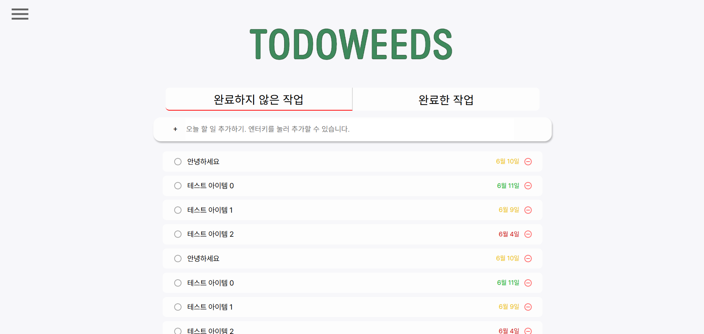
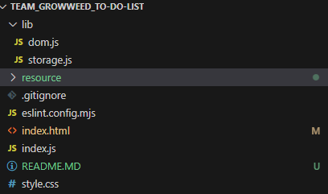

# 잡초농가 팀 ToDoList 프로젝트

- Preview


todolist를 localStorage 라이브러리를 이용해서 관리하는 프로젝트입니다.

<br>

---

# 📋  핵심 기능 요약
| 구분        | 기능 설명                                      | 관련 함수 및 설명                                                    |
| -------------- | ------------------------------------------ | --------------------------------------------------------- |
| 📝 할 일 추가   | 입력 후 버튼 클릭 또는 Enter 키로 할 일 추가              | `handleAdd`, `createItemObject`, `addItemArray`, `renderItem` |
| 🗑 할 일 삭제    | 리스트의 휴지통 아이콘 클릭 시 해당 항목 삭제                 | `handleRemove`, `removeItemArray`, `removeItem`               |
| ✅ 완료 처리    | 체크 아이콘 클릭 시 완료 여부 전환                       | `handleComplete`, `getCompleteTodoListArray`, `removeItem`    |
| 📂 탭 전환     | 완료/미완료 탭 클릭 시 해당 리스트 필터링                   | `moveToCompleteTab`, `moveToInCompleteTab`, `renderTab`       |
| 📦 로컬 저장   | 추가/삭제/완료 시 `localStorage`에 자동 저장           | `getStorage`, `setStorage`                                    |
| 🔄 초기 렌더    | 페이지 로드시 저장된 목록 불러와 렌더링                     | `init`, `renderItem`                                          |
| 🕒 날짜 표시    | 항목 추가 시 등록일을 표시, 1\~3일 이내/오래된 항목은 색상 차등 표시 | `dateFormat`, `getDateDiff`, `fontColorClasses`               |
| 🎨 색상 분류    | 날짜 기준으로 글자색 스타일 지정 (오늘/근접/오래됨)             | `getDateDiff`, `fontColorClasses`                             |
| 🎯 접근 방식    | 각 `<li>` 항목에 `data-id` 부여하여 식별 및 DOM 조작    | `createItem`, `removeItem`, 이벤트 위임 방식                         |


<br>

---

# 🛠️ 사용 기술 스택

| 분류    | 기술                                                 |
| ----- | -------------------------------------------------- |
| 언어    | `HTML`, `CSS`, `JavaScript`                        |
| 저장 방식 | `localStorage`                                     |
| 환경    | `Vanilla JS` 기반 모듈화 (`ES Module`, `import/export`) |
| 스타일   | CSS 모듈 방식, 애니메이션 및 상태 변화 클래스 적용                    |
| 기타    | `VS Code`, `Prettier` 코드 포맷 설정                     |

<br>

---
# Ver 1.0a

lib 디렉터리 유틸 함수 구현 및 디렉터리 구조 설계



``` javascript
export function getNode(separator){
    return document.querySelector(separator);
}

export function insertLast(parent, htmlString){
    parent.insertAdjucentHTML("beforeend", htmlString);
}
```

<br>

---

# Ver 1.01a
node id, class 정의

\* css 디자인 중에 추가된 부분 (사전 정의 이후)

``` html
      <!-- 입력란 section -->
      <section class="add-todo-section">
        <!-- 폼 관련 내용 추가 -->
        <form id="add-todo-form">
          <button type="button" id="add-todo-btn">+</button>
          <input
            id="add-todo-input"
            type="text"
            placeholder="오늘 할 일 추가하기. 엔터키를 눌러 추가할 수 있습니다."
          />
        </form>
      </section>
```
시맨틱 구조 강화를 위해 폼 관련 내용이 추가되었습니다.

<br>

``` html
      <!-- todo 리스트 main -->
      <main>
        <ul id="todo-list-ul">
          <!-- 1번 li -->
          <li class="todo-list-cell">
            <div class="align-wrap">
                ...
            </div>
            <div class="align-wrap">
                ...
            </div>
        </li>
```
레이아웃 배치를 위해 align-wrap으로 각각 todo-list-complete-btn와 todo-list-text, todo-list-date 와 todo-list-optional 을 묶었습니다.

<br>

``` javascript
let inputForm = document.querySelector('#add-todo-form')

// form submit 처리 방지
inputForm.addEventListener('submit', (e) => { 
    e.preventDefault();
})

```
input 영역에 form이 추가됨으로써, submit action 방지를 위해 index.js에 추가되었습니다.

현 Preview에 보이는 내용으로 화면 구현 완료하였습니다. 버튼을 제외한 모든 요소가 vw, vh로 설계되어 반응형으로 작동합니다.

<br>

---
# Ver 1.1b

기존에 정의된 요구사항 모두 구현 완료
- TODO 추가
- TODO 삭제
- TODO 완료처리
- TODO 날짜 기반 하이라이팅
- TODO 완료, 미완료 탭 이동

팀원들 코드별로 merge 완료했습니다. 주석으로 작성자의 이름이 적혀 있습니다.

<br>

---

<br>

# 팀원별 기능 구현 상황

## 윤대웅

- 프로젝트 디자인
    - figma 이용해 node들의 사이즈 정의함.
- HTML, CSS 구현
    - 반응형으로 동작하도록 대부분의 오브젝트 사이즈를 vw, vh로 정의함.
    - 인터렉션 기능들 추가로 구현 완료
- 클릭 이벤트, `submit` 이벤트 등 관리
- TODO  `localStorage` 저장, 삭제
- TODO 노드요소 삽입 구현
- TODO 완료, 미완료 상태 구현
- 완료, 미완료 탭 이동 구현
- 등록 날짜 기준 하이라이팅 구현

## 김윤지

- 추가 이벤트 구현
    - `submit`을 통해 +버튼, enter 키 이벤트 한번에 관리
- 클릭 이벤트 구현(제거, 완료 클릭 시)
- todo `localStorage` 저장, 삭제
    - `todoListArray` 전역변수 ⇒ `localStorage`에서 `set`, `get`으로 변경
- 미완료, 완료 탭 이벤트 구현(탭 상태에 따라 렌더링)
- 날짜 변환 구현
    - `localStorage`에서 문자열로 저장됨. date객체로 변환하여 전달

## 정소영

- 제출 이벤트 구현(입력값 읽기, 배열 저장, `localStorage`저장, `li` 생성 및 목록 추가)
- 삭제 버튼 이벤트 구현(해당 `li` 항목 제거, 제거 항목 배열에서 삭제 및 `localStorage` 업데이트)
    - `li` 항목 제거(제거는 가능하나 새로고침 필요)

## 성창식

- 할 일 추가 및 삭제 구현
    - 입력값(text → li)추가, 삭제 버튼 클릭 시 해당 항목 삭제 및 localStorage 업데이트
- 완료/미완료 상태 토글
    - 완료 버튼 클릭 시 해당 항목의 완료 상태(`true/false`)를 반전시키고, 아이콘과 텍스트 스타일을 변경하며 `localStorage`도 갱신합니다
- 이벤트 위임 처리
    - `ul`에 클릭 이벤트를 위임해 동적으로 생성되는 항목에서도 삭제/완료 버튼이 작동하도록 설정했습니다.

---

<br>

# 각 팀원별 원본 깃허브
윤대웅 : https://github.com/yoon5450/MyToDoList

정소영 : https://github.com/Young-mang/Team_GrowWeed_To-Do-List

김윤지 : https://github.com/yoon00/To-Do-List

성창식 : https://github.com/sikchang/Team_GrowWeed_To-Do-List

손영웅 : https://github.com/heroson02/TodoList/