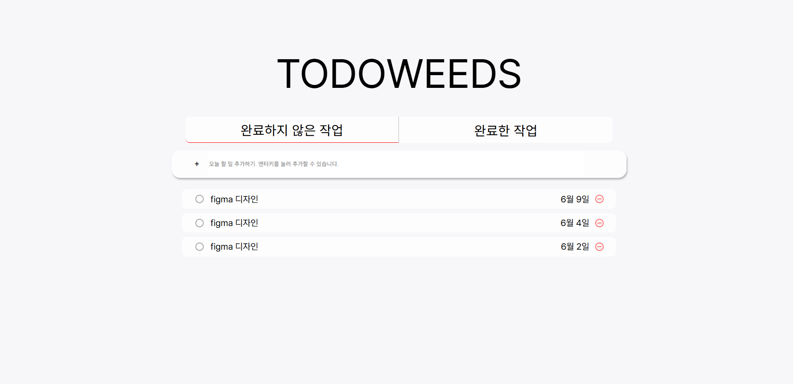

### 잡초농가 팀 ToDoList 프로젝트

---
- Preview


todolist를 localStorage 라이브러리를 이용해서 관리하는 프로젝트입니다.

---
# Ver 1.0a

lib 디렉터리 유틸 함수 구현 및 디렉터리 구조 설계


``` javascript
export function getNode(separator){
    return document.querySelector(separator);
}

export function insertLast(parent, htmlString){
    parent.insertAdjucentHTML("beforeend", htmlString);
}
```

---

# Ver 1.01a
node id, class 정의

\* css 디자인 중에 추가된 부분 (사전 정의 이후)

``` html
      <!-- 입력란 section -->
      <section class="add-todo-section">
        <!-- 폼 관련 내용 추가 -->
        <form id="add-todo-form">
          <button type="button" id="add-todo-btn">+</button>
          <input
            id="add-todo-input"
            type="text"
            placeholder="오늘 할 일 추가하기. 엔터키를 눌러 추가할 수 있습니다."
          />
        </form>
      </section>
```
시맨틱 구조 강화를 위해 폼 관련 내용이 추가되었습니다.

<br>

``` html
      <!-- todo 리스트 main -->
      <main>
        <ul id="todo-list-ul">
          <!-- 1번 li -->
          <li class="todo-list-cell">
            <div class="align-wrap">
                ...
            </div>
            <div class="align-wrap">
                ...
            </div>
        </li>
```
레이아웃 배치를 위해 align-wrap으로 각각 todo-list-complete-btn와 todo-list-text, todo-list-date 와 todo-list-optional 을 묶었습니다.

<br>

``` javascript
let inputForm = document.querySelector('#add-todo-form')

// form submit 처리 방지
inputForm.addEventListener('submit', (e) => { 
    e.preventDefault();
})

```
input 영역에 form이 추가됨으로써, submit action 방지를 위해 index.js에 추가되었습니다.